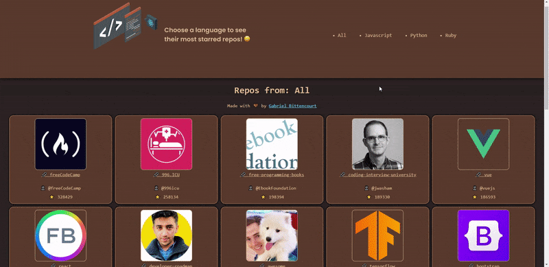

  
  <h1>Most popular repos by language!</h1>
  
Check the live demo ⬇️

## Sobre
Um projeto feito utilizando a API do github para filtar os repositórios com mais estrelas no site, podendo filtrar eles por linguagem ('All', 'Javascript', 'Python' e 'Ruby').

Realizado com o intuito de fixar conhecimentos tais como:
  - Utilização de classes
    - Constructor dentro de classes
      - Propriedade `super()`
      - `ComponentWillMount()`
      - `ComponentWillUnmount()`
      - `ComponentDidUpdate()`
    - Manuseio de estados dentro de classes
  - Construção de componentes
    - Utilização de componente de Loading

## Imagem

  

## Autor

## [Gabriel Bittencourt Penteado](https://www.linkedin.com/in/gabriel-bittencourt-penteado/)

#### Feito com 🤎 por *Gabriel Bittencourt Penteado*. Entre em contato! 👋🏽
